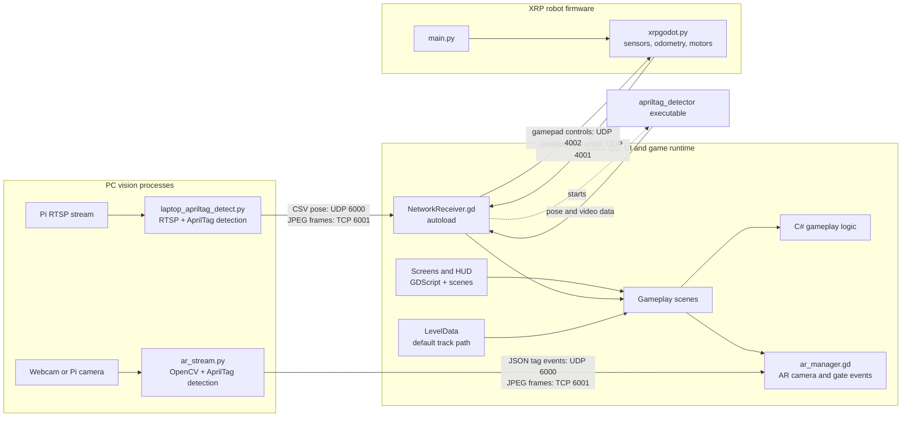
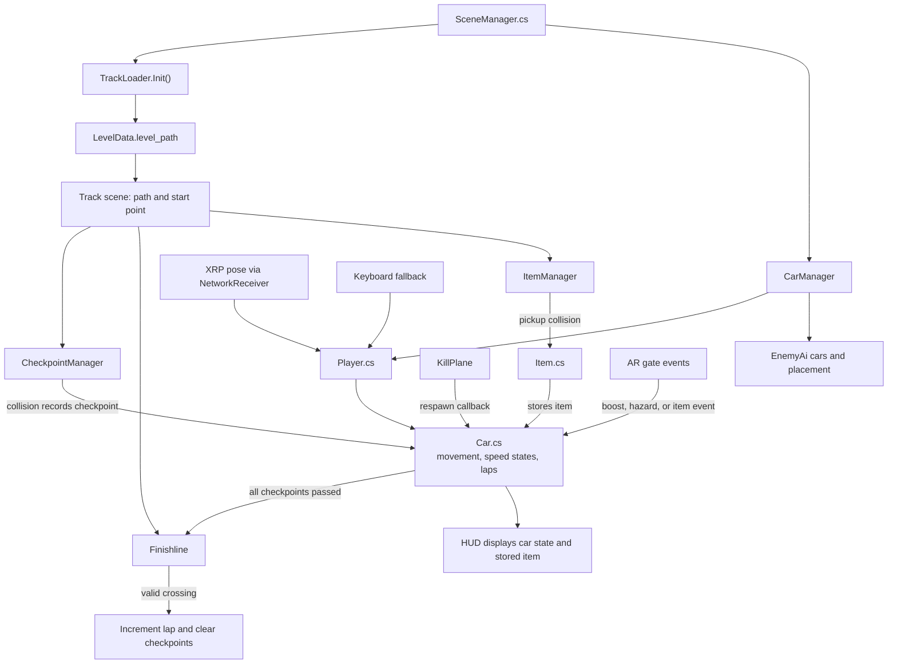
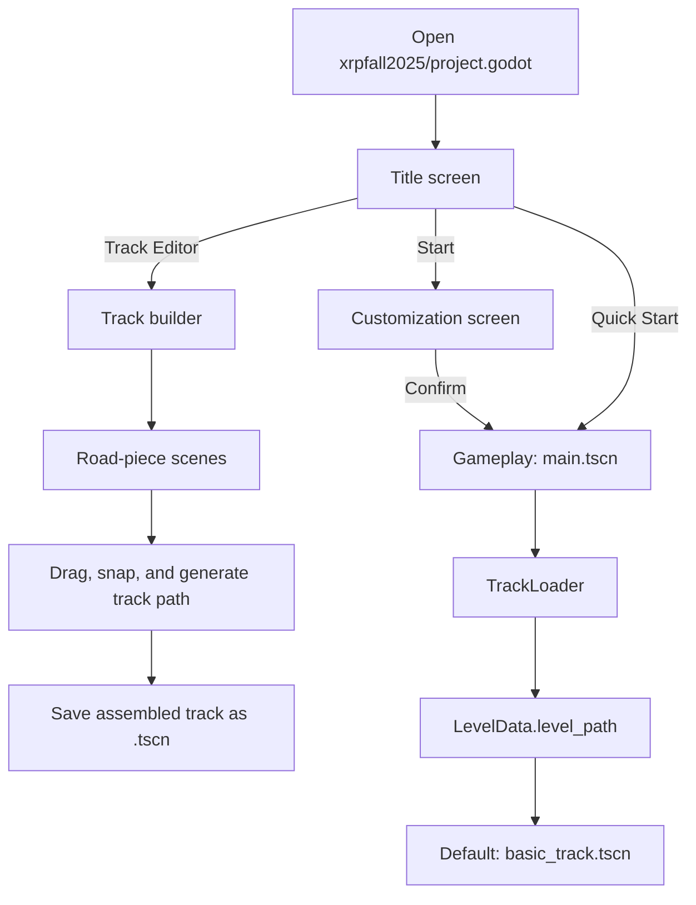

## System Overview

```mermaid
flowchart LR
    subgraph Godot["Godot app: UI and game runtime"]
        UI["Screens and HUD<br/>GDScript + scenes"] --> Runtime["Gameplay scenes"]
        Runtime --> Core["C# gameplay logic"]
        Runtime --> AR["ar_manager.gd<br/>AR camera and gate events"]
        Auto["NetworkReceiver.gd<br/>autoload"] --> Runtime
        Level["LevelData<br/>default track path"] --> Runtime
    end

    subgraph Vision["PC vision processes"]
        Webcam["Webcam or Pi camera"] --> Stream["ar_stream.py<br/>OpenCV + AprilTag detection"]
        PiRTSP["Pi RTSP stream"] --> Laptop["laptop_apriltag_detect.py<br/>RTSP + AprilTag detection"]
    end

    Stream -->|"JSON tag events: UDP 6000<br/>JPEG frames: TCP 6001"| AR
    Laptop -->|"CSV pose: UDP 6000<br/>JPEG frames: TCP 6001"| Auto
    Auto -. "starts" .-> Detector["apriltag_detector executable"]
    Detector -->|"pose and video data"| Auto

    subgraph XRP["XRP robot firmware"]
        Boot["main.py"] --> Firmware["xrpgodot.py<br/>sensors, odometry, motors"]
    end
    Firmware -->|"position and angle: UDP 4001"| Auto
    Auto -->|"gamepad controls: UDP 4002"| Firmware
```

## Core Gameplay Logic

```mermaid
flowchart TD
    Setup["SceneManager.cs"] --> Loader["TrackLoader.Init()"]
    Loader --> Level["LevelData.level_path"]
    Level --> Track["Track scene: path and start point"]
    Track --> Checkpoints["CheckpointManager"]
    Track --> Finish["Finishline"]
    Track --> Items["ItemManager"]

    Setup --> Cars["CarManager"]
    Cars --> Player["Player.cs"]
    Cars --> AI["EnemyAi cars and placement"]

    XRP["XRP pose via NetworkReceiver"] --> Player
    Keyboard["Keyboard fallback"] --> Player
    Player --> Car["Car.cs<br/>movement, speed states, laps"]

    Checkpoints -->|"collision records checkpoint"| Car
    Car -->|"all checkpoints passed"| Finish
    Finish -->|"valid crossing"| Lap["Increment lap and clear checkpoints"]
    KillPlane["KillPlane"] -->|"respawn callback"| Car

    Items -->|"pickup collision"| Item["Item.cs"]
    Item -->|"stores item"| Car
    Car --> HUD["HUD displays car state and stored item"]
    AR["AR gate events"] -->|"boost, hazard, or item event"| Car
```

## Startup and Track Flow

```mermaid
flowchart TD
    Project["Open xrpfall2025/project.godot"] --> Title["Title screen"]
    Title -->|"Start"| Customize["Customization screen"]
    Customize -->|"Confirm"| Main["Gameplay: main.tscn"]
    Title -->|"Quick Start"| Main
    Title -->|"Track Editor"| Editor["Track builder"]

    Editor --> Pieces["Road-piece scenes"]
    Pieces --> Assemble["Drag, snap, and generate track path"]
    Assemble --> Save["Save assembled track as .tscn"]

    Main --> Loader["TrackLoader"]
    Loader --> Data["LevelData.level_path"]
    Data --> Default["Default: basic_track.tscn"]
```
