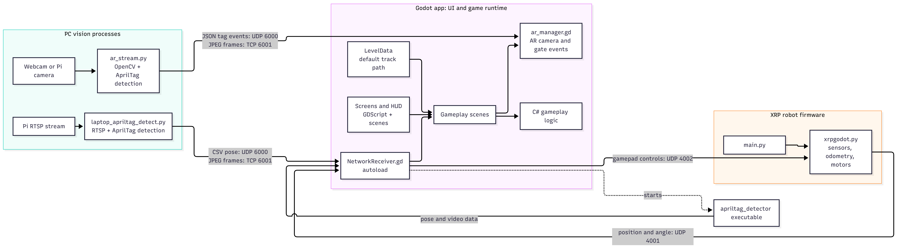
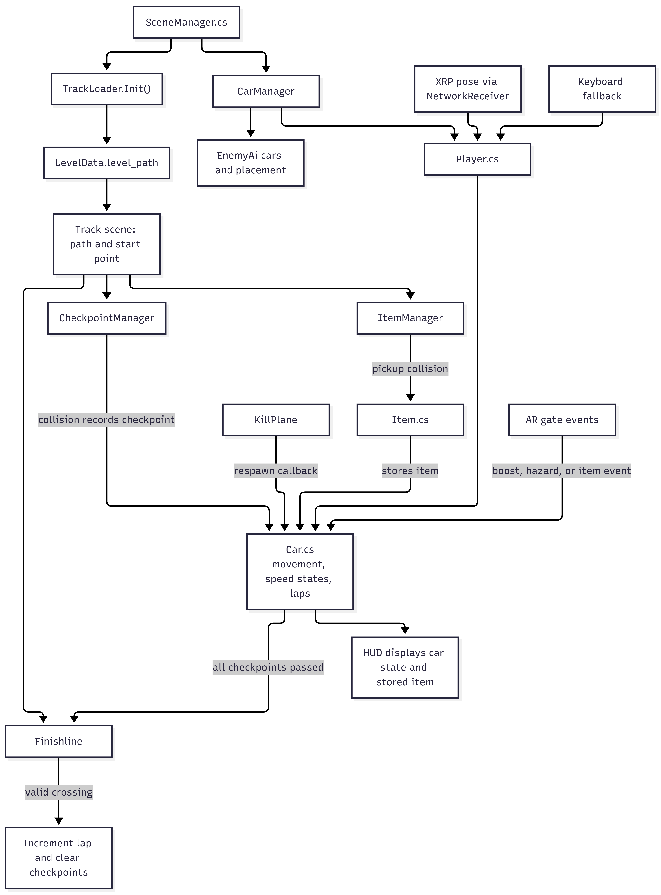
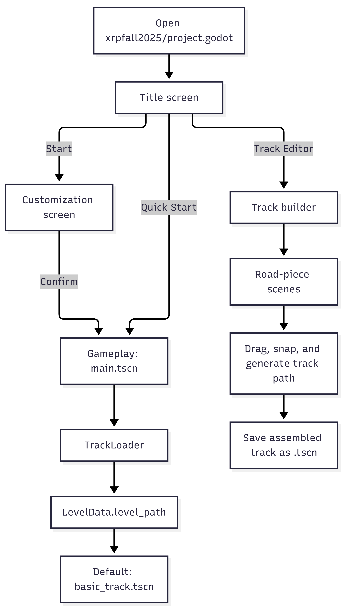

# Architecture

This page describes how the Godot game, PC-side AprilTag vision scripts, and XRP robot firmware fit together, and where the main gameplay logic lives.

> **Note:** This is an ongoing project, so the architecture described here may vary as development continues.

Editable Mermaid source for all three diagrams is in [architecture-code.md](architecture-code.md).

## System Overview

Godot owns the game UI and runtime. Separate PC-side vision scripts process camera input, while MicroPython firmware runs on the XRP robot. They communicate with Godot over network sockets.

## Core Gameplay Logic

`SceneManager` initializes the track, cars, checkpoints, finish line, and item system. C# classes own most racing rules; GDScript manages the HUD and AR event presentation.

## Startup and Track Flow

The configured main scene is the title screen. The track editor assembles road-piece scenes and saves a `.tscn`; gameplay obtains its selected track from `LevelData`.

The saved track and the gameplay-selected track are separate in the current code: the editor saves a `.tscn`, while `LevelData` currently defaults to `basic_track.tscn`.

## Main Code Areas

- `xrpfall2025/project.godot`: Godot project settings, main scene, and autoloads.
- `xrpfall2025/Scenes/GameplayScenes/`: title, gameplay, customization, and track-builder scenes.
- `xrpfall2025/Scripts/`: GDScript integration and C# gameplay systems.
- `xrpfall2025/Scripts/ar_stream.py` and `laptop_apriltag_detect.py`: PC-side camera and AprilTag processing.
- `xrpFiles/`: XRP robot MicroPython startup and control firmware.